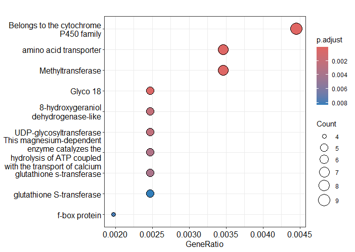
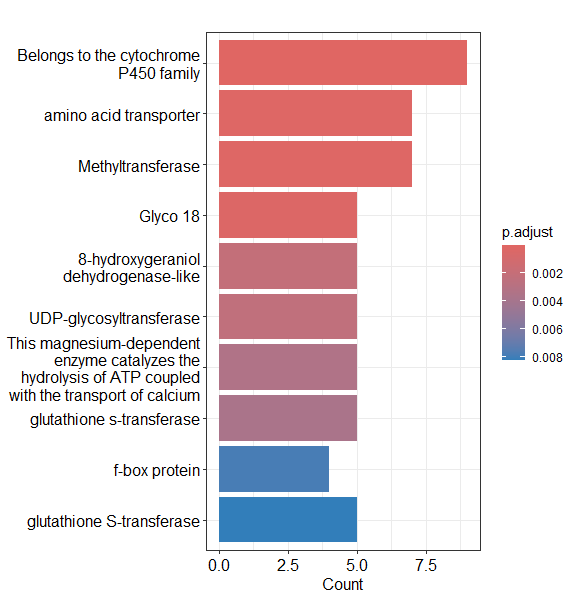

# Rust_Transcriptomics_Practice
# Functional Categories and Genes Enrichment Practice for Students

# Part 1: Genes Enrichment Analysis

## 0. Load the libraries. 
```r
library(DESeq2)     # For differential expression analysis
library(tidyverse)  # For data manipulation (optional, useful for merging and plotting)
library(readr)      # For reading TSV/CSV files
library(dplyr)      # For filtering and data manipulation
library(clusterProfiler)  # For enrichment analysis
library(DOSE)         # Helper functions for enrichment
library(enrichplot)   # Visualization of enrichment results
```

## 1. Set the working directory. 
```r
setwd("D:/lucianoboa/royatranscriptomics/analysis/practice")
```

## 2. Load count matrix. 
```r
countData <- read.table("counts_matrix_transcript_id.txt", 
                        header = TRUE, row.names = 1, sep = "\t")

# Select only count columns (columns 6 to 21)
countData <- countData[, 6:21]

# Rename columns for simplicity
colnames(countData) <- c("H10","H11","H12","H13","H14","H15","H16","H9",
                         "T1","T2","T3","T4","T5","T6","T7","T8")
```

## 3. Define experimental groups. 
```r
group <- rep(NA, ncol(countData))
names(group) <- colnames(countData)

group[c("T1","T2","T3","T4","T5","T6","T7","T8")] <- "Group_1"
group[c("H9","H11","H13","H14","H15","H16")] <- "Group_2"
group[c("H10","H12")] <- "Group_3"

group <- factor(group)
```

### Create colData for DESeq2.
```r
colData <- data.frame(row.names = colnames(countData),
                      group = group)
```

## 4. Create DESeq2 dataset.
```r
dds <- DESeqDataSetFromMatrix(countData = countData, 
                              colData = colData, 
                              design = ~ group)
```

## 5. Filter low-expression genes.
```r
dds <- dds[rowSums(counts(dds)) > 10,]
```

## 6. Run DESeq2 differential expression.
```r
dds <- DESeq(dds)
```

## 7. Extract contrasts / results.
```r
res_G2vsG1 <- results(dds, contrast = c("group", "Group_2", "Group_1"))
res_G3vsG1 <- results(dds, contrast = c("group", "Group_3", "Group_1"))
res_G2vsG3 <- results(dds, contrast = c("group", "Group_2", "Group_3"))

# Order by adjusted p-value
res_G2vsG1 <- res_G2vsG1[order(res_G2vsG1$padj), ]
res_G3vsG1 <- res_G3vsG1[order(res_G3vsG1$padj), ]
res_G2vsG3 <- res_G2vsG3[order(res_G2vsG3$padj), ]
```

## 8. Extract DEGs with strict filtering.
```r
deg_G2vsG1 <- subset(res_G2vsG1, padj < 0.05 & abs(log2FoldChange) > 1)
deg_G3vsG1 <- subset(res_G3vsG1, padj < 0.05 & abs(log2FoldChange) > 1)
deg_G2vsG3 <- subset(res_G2vsG3, padj < 0.05 & abs(log2FoldChange) > 1)
```

## 9. Export DEGs.
```r
# G2 vs G1
write.csv(deg_G2vsG1, file = "DEG_G2_vs_G1_strict.csv")
write.csv(subset(deg_G2vsG1, log2FoldChange > 1), file = "Up_DEG_G2_vs_G1_strict.csv")
write.csv(subset(deg_G2vsG1, log2FoldChange < -1), file = "Down_DEG_G2_vs_G1_strict.csv")

# G3 vs G1
write.csv(deg_G3vsG1, file = "DEG_G3_vs_G1_strict.csv")
write.csv(subset(deg_G3vsG1, log2FoldChange > 1), file = "Up_DEG_G3_vs_G1_strict.csv")
write.csv(subset(deg_G3vsG1, log2FoldChange < -1), file = "Down_DEG_G3_vs_G1_strict.csv")

# G2 vs G3
write.csv(deg_G2vsG3, file = "DEG_G2_vs_G3_strict.csv")
write.csv(subset(deg_G2vsG3, log2FoldChange > 1), file = "Up_DEG_G2_vs_G3_strict.csv")
write.csv(subset(deg_G2vsG3, log2FoldChange < -1), file = "Down_DEG_G2_vs_G3_strict.csv")
```

### Here you can check out the files we created. 
(DEG_G2_vs_G1_strict.csv)
(DEG_G2_vs_G3_strict.csv)
(DEG_G3_vs_G1_strict.csv)
(Down_DEG_G2_vs_G1_strict.csv)
(Down_DEG_G2_vs_G3_strict.csv)
(Down_DEG_G3_vs_G1_strict.csv)
(Up_DEG_G2_vs_G1_strict.csv)
(Up_DEG_G2_vs_G3_strict.csv)
(Up_DEG_G3_vs_G1_strict.csv)

## 10. Load DEGs.
For this example, we will use the "Up_DEG_G2_vs_G1_strict.csv" file. However, you can repeat the protocol with all the comparisons you want. 
```r
diff_genes <- read_delim("Up_DEG_G2_vs_G1_strict.csv", delim = ",")
colnames(diff_genes)[1] <- "ID"       # Rename first column
diff_genes <- diff_genes[, c("ID", "log2FoldChange")]
```

## 11. Load full annotation file (LOC IDs).
```r
annotation <- read_delim("fullAnnotation.tsv.txt", delim = "\t", col_types = cols())
# Assume at least these columns exist: "ID", "GO", "description"
```
                                                
## 12. Filter annotation for DEGs.
```r
deg_annot <- annotation %>%
  filter(ID %in% diff_genes$ID)

deg_genes <- deg_annot$ID  
```

## 13. Setup your universe of genes. 
```r
all_genes <- annotation$ID  
```

## 14. Execute enrichment. 
```r
deg_ID <- deg_annot$ID
term2gene <- annotation[, c("GOs", "ID")]  # ajusta "GOs" al nombre exacto de tu columna GO
term2name <- annotation[, c("GOs", "Description")]  # opcional

ora_GOs <- enricher(
  gene = deg_ID,         # vector de genes, no GO
  universe = all_genes,        # vector de todos los genes detectados
  pAdjustMethod = "BH",
  qvalueCutoff = 0.05,
  TERM2GENE = term2gene,
  TERM2NAME = term2name
)
```

## 15. Results

### Number of significant GO terms.
```r
sum(ora_GOs@result$p.adjust < 0.05)
```

### Dotplot of the 10 most significant GOs of Group_2 vs Group_1.
```r
dotplot(ora_GOs, showCategory = 10)
```


### Barplot of the 10 most significant GOs of Group_2 vs Group_1.
```r
barplot(ora_GOs, showCategory = 10)
```


### Enrichment map of Group_2 vs Group_1
```r
ora_GOs <- pairwise_termsim(ora_GOs, method = "JC")
emapplot(ora_GOs, color = "qvalue", showCategory = 15)
```

# Part 2: Functional categories 

## 1. Add readable COG names. 
```r
cog_dict <- c(
  "C"="Energy production and conversion", "D"="Cell cycle control, cell division, chromosome partitioning",
  "E"="Amino acid transport and metabolism", "F"="Nucleotide transport and metabolism",
  "G"="Carbohydrate transport and metabolism", "H"="Coenzyme transport and metabolism",
  "I"="Lipid transport and metabolism", "J"="Translation, ribosomal structure and biogenesis",
  "K"="Transcription", "L"="Replication, recombination and repair",
  "M"="Cell wall/membrane/envelope biogenesis", "N"="Cell motility",
  "O"="Posttranslational modification, protein turnover, chaperones",
  "P"="Inorganic ion transport and metabolism", "Q"="Secondary metabolites biosynthesis, transport and catabolism",
  "R"="General function prediction only", "S"="Function unknown",
  "T"="Signal transduction mechanisms", "U"="Intracellular trafficking, secretion, vesicular transport",
  "V"="Defense mechanisms", "W"="Extracellular structures", "Y"="Nuclear structure", "Z"="Cytoskeleton"
)

annotation <- annotation %>%
  mutate(COG_name = cog_dict[COG_category])
```

## 2. Choose the DEGs you want to compare and merge with COG terms.
In this case, we are comparing G2 vs G1. 
```r
deg_up <- subset(deg_G2vsG1, log2FoldChange > 1)
deg_down <- subset(deg_G2vsG1, log2FoldChange < -1)

deg_up_annot <- deg_up %>%
  as_tibble(rownames = "ID") %>%  # convierte rownames a columna "ID"
  left_join(dplyr::select(annotation, ID, COG_category, COG_name), by = "ID")

deg_down_annot <- deg_down %>%
  as_tibble(rownames = "ID") %>%
  left_join(dplyr::select(annotation, ID, COG_category, COG_name), by = "ID")
```

## 3. Summarize functional categories.
```r
universe_summary <- annotation %>%
  filter(!is.na(COG_name)) %>%
  group_by(COG_name) %>%
  summarise(Universe = n_distinct(ID))

up_summary <- deg_up_annot %>%
  filter(!is.na(COG_name)) %>%
  group_by(COG_name) %>%
  summarise(Up = n_distinct(ID))

down_summary <- deg_down_annot %>%
  filter(!is.na(COG_name)) %>%
  group_by(COG_name) %>%
  summarise(Down = n_distinct(ID))

# Merge the summaries.
summary_table <- universe_summary %>%
  full_join(up_summary, by="COG_name") %>%
  full_join(down_summary, by="COG_name") %>%
  replace(is.na(.), 0) %>%
  arrange(desc(Universe))
```

## 4. Export and view your results. 
```r
write_csv(summary_table, "Summary_COG_categories_G2_vs_G1.csv")
print(summary_table, n=21)
```

```r
> print(summary_table, n=21)
# A tibble: 21 × 4
   COG_name                                                     Universe    Up  Down
   <chr>                                                           <int> <int> <int>
 1 Function unknown                                                24088   558  1023
 2 Signal transduction mechanisms                                   7463   169   367
 3 Transcription                                                    5470   152   159
 4 Replication, recombination and repair                            5250    29    55
 5 Posttranslational modification, protein turnover, chaperones     5051   106   269
 6 Carbohydrate transport and metabolism                            3032   157   170
 7 Secondary metabolites biosynthesis, transport and catabolism     2699   158   195
 8 Translation, ribosomal structure and biogenesis                  2421    31   129
 9 Amino acid transport and metabolism                              2311    88    95
10 Intracellular trafficking, secretion, vesicular transport        1974    63    52
11 Lipid transport and metabolism                                   1749    57    56
12 Inorganic ion transport and metabolism                           1601    54    99
13 Energy production and conversion                                 1538    56   132
14 Cell cycle control, cell division, chromosome partitioning        978    13    12
15 Coenzyme transport and metabolism                                 886    25    63
16 Cytoskeleton                                                      739    14    15
17 Nucleotide transport and metabolism                               676    22    30
18 Defense mechanisms                                                660    24    49
19 Cell wall/membrane/envelope biogenesis                            549    15    39
20 Nuclear structure                                                  37     0     1
21 Extracellular structures                                            8     0     0
```
